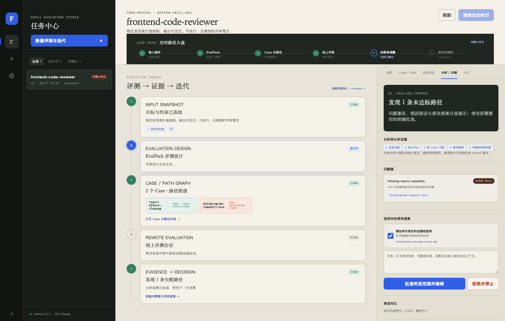

# FORGE / ACEval

FORGE 是一个本地优先的 Skill 评测与进化桌面工具；ACEval 是它的确定性 Kernel。

用户提供 Skill 仓库、目标/标准、可选 Case 和运行环境，系统会自动生成或复用
EvalPack，补齐 Case 与语义评测路径，在真实远程 Agent 上并行运行，回收逐 Case
完整日志，由本地分析 Agent 生成问题簇和修改提案，再由确定性门禁控制多文件候选、
回归、Champion/Challenger 晋升和收敛。

它不是静态报告页，也不是“让一个模型自己出题、自己改 Skill、自己宣布变好”的脚本。



## 当前产品能力

- repair、tune、extend、discover、create 五类 Skill 生命周期任务；
- 用户无感 EvalPack 生成/精确复用，也支持自定义 EvalPack 与用户 Case；
- 测试义务、Case、required/recommended/alternative/forbidden 语义路径；
- CATX 多会话、双仓库挂载、不可变 Skill commit、轮询/SSE 和完整日志回收；
- Attempt → Case Aggregate → Candidate Comparison 三层判定；
- Outcome、Procedure、Grounding、Runtime、可选 Efficiency 与 pass@k/pass^k；
- 证据有效性、硬路径失败、跨 Case 问题簇、冲突与精确修改范围；
- `SKILL.md`、`scripts/`、`references/`、模板和配置的受控多文件候选；
- 用户批准门、Git commit/push、被拒候选的可审计 revert、稳定通过保护；
- D2C 独立 Chrome Worker、交互预览、受控插件、DOM/网络/控制台/截图/像素差异证据；
- Skill 与 Agent 共用的 `EvaluationSubject` 控制面契约。
- Codex `config.toml` / `auth.json` 分离导入、隔离 Profile、真实 GPT 目录与推理强度选择；API Key Profile 走低 Token Responses 主路径，OAuth Profile 回退 App Server。

完整产品与架构基线见
[最终系统架构](docs/current/FINAL_SYSTEM_ARCHITECTURE.md) 和
[Kernel V2](docs/current/EVALUATION_SELF_ITERATION_KERNEL_V2.md)。当前完成状态、真实验收边界和
下一会话优先级见 [交接文档](docs/current/NEXT_SESSION_HANDOFF.md)。

## 桌面端使用

当前 macOS arm64 开发构建位于：

`desktop/dist/mac-arm64/FORGE Skill Evolution Studio.app`

该 `.app` 已内置 arm64 Python Kernel 和 Electron Node，不要求最终用户安装 Python 或
Node。Git 用于仓库操作；D2C 需要本机 Google Chrome/Chromium。应用尚未使用 Apple
Developer ID 签名/公证，因此它是本地验证构建，不是公开分发安装包。

启动后：

1. 在“配置与环境”中完成 Kernel / Git / D2C / Codex 体检，分别导入 Codex `config.toml` 与 `auth.json` 的隔离副本，读取并验证 GPT 模型；CATX/PAT 等其他密钥保存到系统安全存储；
2. 创建任务，填写 Skill 仓库、分支、目标/标准、可选代码仓库和 Case；
3. 如有自己的 EvalPack，选择目录；留空时系统自动生成或复用；
4. 创建后立即进入任务详情，观察 EvalPack、Case/Path、远程会话和日志事件；
5. 在分析门选择修改提案并补充意见；系统继续生成、发布、复评，直到晋升、拒绝或安全停止。

Codex 导入副本位于客户端私有 Profile，权限为 0600；原始 `~/.codex`、项目配置和 Claude 配置不会被修改。CATX/PAT 等凭据只进入 Electron `safeStorage` 和受控子进程环境，任务配置不持久化明文。

桌面开发与构建说明见 [desktop/README.md](desktop/README.md)。

## 源码运行

要求 Python 3.9+；Python 3.9/3.10 会安装 TOML 兼容解析器。

```bash
python3 -m venv .venv
source .venv/bin/activate
python -m pip install -e '.[dev,yaml]'
aceval --version
```

启动桌面开发模式：

```bash
cd desktop
npm install
npm start
```

生成自包含 macOS 应用：

```bash
python3 -m pip install -e '.[desktop-build]'
cd desktop
npm run dist:mac
```

构建机器上的 Python 与 Electron 目标架构必须一致；可通过 `ACEVAL_BUILD_PYTHON`
指定构建 Python。Node.js 要求 >= 20.19。

## 核心流程

```text
用户输入 / Skill / 环境
  → EvalPack 生成或复用
  → Test Obligation / Case / Path
  → 真实远程 Session 批量运行
  → 完整日志和产物回收
  → 证据有效性与多维 Verdict
  → 跨 Case Diagnosis Graph
  → 用户批准 Proposal / Scope
  → 受控多文件 Candidate
  → 成对回归与稳定性验证
  → Promote / Reject / Safe Stop
```

模型负责语义评分、根因假设和候选内容；Kernel 负责证据资格、硬事实、预算、回归、
版本比较、晋升和停止。无效或不完整证据返回 `not_evaluable`，不会被误记为 Skill 失败。

## D2C 验证

D2C 分为两个隔离环境：

- 预览窗口允许加载经过 manifest、权限白名单和 SHA-256 校验的本地插件，供人工探索；
- 评分 Worker 使用临时 Chrome Profile、禁用插件，冻结 viewport/locale/timezone/color scheme，
  采集 DOM、console、network、title、URL、截图和视觉差异。

设计稿会被冻结路径与 hash；Actual、Reference、Diff 和 receipt 与 Case、Attempt、candidate
commit 一一关联。代码执行进程与领域 Grader 可以物理隔离，但初测、复验和候选对比必须继承
同一份冻结环境契约；Git revision、浏览器版本、Fixture 与评分参数漂移时停止比较。

## 验证

```bash
PYTHONPATH=src python3 -m pytest -q
cd desktop
node tests/renderer-contract.test.mjs
```

真实浏览器发布烟测入口为 `tests/run_real_d2c_smoke.py`。测试产物写入 `.aceval/`，不会进入 Git。

## 文档

- [docs/current/FINAL_SYSTEM_ARCHITECTURE.md](docs/current/FINAL_SYSTEM_ARCHITECTURE.md)：唯一有效的产品与系统架构；
- [docs/current/EVALUATION_SELF_ITERATION_KERNEL_V2.md](docs/current/EVALUATION_SELF_ITERATION_KERNEL_V2.md)：Case、路径、Verdict、诊断和收敛算法；
- [design/desktop-v2/PRODUCT_DESIGN_V2.md](design/desktop-v2/PRODUCT_DESIGN_V2.md)：已确认桌面信息架构与视觉基线；
- [docs/current/PRODUCT_RELEASE_READINESS.md](docs/current/PRODUCT_RELEASE_READINESS.md)：当前实现、验证证据与发布边界；
- [docs/reference/EVALPACK_SPEC.md](docs/reference/EVALPACK_SPEC.md)：EvalPack 兼容规范；
- [docs/runbooks](docs/runbooks)：CATX 与代码评审场景操作手册；
- [docs/archive/2026-08-pre-v2](docs/archive/2026-08-pre-v2)：旧 MVP/V1/未采纳方案，仅作决策记录。

## Agent 复用

Kernel 不把“Skill 文件”写死为唯一被测对象。`EvaluationSubject` 定义不可变 identity、
revision、resources、execution binding 和 mutation surface；SkillSubject 与 AgentSubject 只在
Adapter、可变面和运行绑定上不同。Case/Path、Session/Trace、Verdict、Diagnosis、Candidate
Comparison 与 Convergence Controller 可直接复用，Agent 级别仅需增加版本化 Agent 配置、
工具集/权限快照和相应候选发布 Adapter。

## 安全说明

不要把真实 API Key、PAT、访问令牌或含敏感会话内容的 `.aceval/` 目录提交到仓库。
Renderer 无 Shell、Git、远程 Session 或任意文件读取权限；所有副作用经过主进程 IPC
白名单和 Python Kernel 的版本化命令执行。
