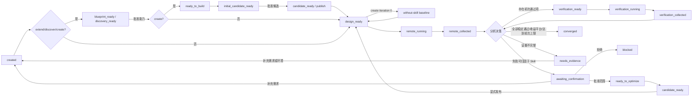

# Skill 评测与迭代 Kernel V1

> V1 描述当前已实现闭环；Case 质量、Trial 多维判定、跨 Case 诊断、Champion/Challenger 与可信收敛的升级基线见 [Skill 评测与自迭代 Kernel V2](./EVALUATION_SELF_ITERATION_KERNEL_V2.md)。

## 1. 目标与边界

Kernel 的目标是让用户只完成三件事：配置一次运行环境、描述 Skill 目标/能力或提供少量 Case、在关键门确认蓝图或修改范围。EvalPack、补充 Case、并行会话、日志回收、跨 Case 分析、稳定性复测和收敛判断均由系统完成。

Kernel 是桌面端下面的应用服务，不依赖具体 UI。当前 CLI 与后续桌面端使用同一套版本化 JSON 契约和持久化状态机，避免把核心逻辑写进页面。

EvalPack 是内部的可复用评测资产，用于冻结评测定义和记录来源；它不决定 Skill 如何修改，也不会成为每轮优化的前置重型步骤。

Kernel 现在同时支持 `repair`、`tune`、`extend`、`discover` 和 `create`。完整模式、能力蓝图、无 Skill 对照与多文件安全设计见 [SKILL_HARNESS_V1.md](./SKILL_HARNESS_V1.md)。

## 2. 核心实现映射

| 层 | 用户看到的概念 | Kernel 实现 | 主要产物 |
|---|---|---|---|
| 1. 配置 | Skill、源码、本地模型、远程 Agent | `KernelConfig`、CATX Profile、环境变量密钥引用 | `kernel/config.json` |
| 2. 输入 | 操作模式、Case/预期、目标、能力、非目标 | `KernelInput`、`UserCase` | `kernel/input.json` |
| 3. 能力蓝图 | 扩展/探索/新建方案与精确文件计划 | `CapabilityArchitect` | `kernel/blueprints/` |
| 4. EvalPack | 默认无感，可查看/复用/替换 | `compile_evaluation` | `.aceval/packs/` 或自定义 Pack |
| 5. Case 与路径 | 自动补齐的 Case、关键步骤 | `create_planning_artifacts`、语义执行路径 | `evaluation-design.json`、`execution-paths.json` |
| 6. 多路评测 | 一批并行中的远程会话 | `RemoteBatchCoordinator.dispatch` | `batches/evaluation.json` |
| 7. 结果回收 | 每个 Case 状态和完整会话日志 | 可恢复轮询、完整 CATX 日志抓取 | `runs/<purpose>/*.json` |
| 8. 分析与优化 | 通过/失败/偶现、冲突、建议、确认和收敛 | `CrossCaseAnalyzer`、`SkillTreeOptimizer`、`SkillProjectBuilder`、`GitSkillPublisher` | `analysis-decision.json`、`candidate.json` |

## 3. 用户输入模式

用户无需理解 EvalPack，可从任意输入量开始：

- Case + 预期结果：保留为用户种子，自动补覆盖 Case。标量或普通结构默认按精确结果判断；需要语义判断时，设置 Case `metadata.expectation_mode` 为 `semantic`。
- Case 或目标：系统补全 Case 和执行路径，本地分析 Agent 基于标准与证据判断结果。
- 无 Case、无目标：系统采用探索型默认目标与安全标准，从 Skill 能力图生成首批 Case。
- 自定义 EvalPack：通过 `evalpack_path` 挂载团队已审核的 Pack，复用其中 dev Case/Oracle，并继续补充能力覆盖；holdout 不进入优化证据。
- 明确扩展：设置 `operation=extend` 和 `capabilities`；系统先生成能力蓝图，再冻结能力、边界、负向触发和旧能力回归 Case。
- 探索能力：设置 `operation=discover`；系统至少生成两个方案，用户通过 `--select-capability` 选择后才实现。
- 新建 Skill：目标仓库分支不含 `SKILL.md`，设置 `operation=create`；系统生成首版多文件候选，经过候选预览门后发布，并执行无 Skill 对照。

用户补充诉求时会形成新的输入修订并重新进入 Case/路径设计，不会在旧设计上静默修改标准。

## 4. 状态机



所有自动动作都校验前置状态。进程在创建会话、轮询或抓取日志期间退出后，可以从批次文件继续，不会重复创建已经记录的会话。

## 5. Token 控制

- Case/路径生成主要基于本地静态 Skill 能力图，不为每个 Case 单独调用模型。
- 远程提示只包含 Case、目标、标准和两个挂载仓库的分支，不重复发送整份 Skill。
- 完整日志落盘；本地分析只发送输出摘要、工具类型统计、少量关键证据和原始日志引用。
- 用户提供的精确预期和执行路径先确定性判断；模型不能反转这些结果。
- 每批未决 Case 最多进行一次跨 Case 分析调用，统一识别根因、冲突和最小修改范围。
- 只有确认后才调用一次优化模型生成候选；通过 Case 只额外执行一次稳定性复测。
- Greenfield Builder 不接收冻结 Case prompt/expected output；新 Skill 只有在候选通过且无 Skill 对照明确失败时才获得增量价值计分。
- 优化模型只接收确认范围内的文件，并返回精确的 `old_text → new_text` 小补丁，不回传整仓库或未修改的大文件。
- `max_total_remote_sessions`、`max_remote_prompt_chars`、`max_prompt_chars`、`max_rounds`、`min_improvement` 和 `convergence_patience` 共同限制成本；整批 Prompt 会在创建任何会话前预检。

## 6. 仓库与远程环境

CATX 会话挂载两个独立资源：

- `/workspace/skill`：候选 Skill 仓库；每轮发布后新会话使用配置分支。
- `/workspace/repo`：源码或 Fixture Lab；默认使用配置分支，Case 的 `metadata.fixture_branch` 可覆盖该分支。

CATX 创建资源的接口本身不携带分支，因此 Kernel 将明确的挂载点和分支写入紧凑会话指令，要求 Agent 在执行前准备正确分支。PAT 只通过环境变量名引用，不写入任务、事件或页面快照。

`local_path` 是可选加速项。未提供时，Kernel 会用 argv-only Git 调用把配置的 SSH 仓库和分支克隆到任务管理目录；提供时复用本地 checkout。自动管理的 checkout 会校验 origin、branch 和干净工作区。

## 7. 持久化与桌面端读模型

任务目录是可审计的单一事实源：

```text
.aceval/tasks/<task-id>/
├── task.json
├── events.jsonl
├── kernel/
│   ├── config.json
│   ├── input.json
│   ├── state.json
│   ├── active-design.json
│   ├── blueprints/
│   └── designs/revision-*/
└── iterations/iteration-*/
    ├── batches/
    ├── runs/
    ├── analysis-decision.json
    └── candidates/candidate.json
```

`IterationKernel.snapshot()` 返回任务、配置引用、输入、活动设计、各轮批次、分析决策、候选和日志索引；`session_log()` 通过 Task/Iteration/Purpose/Case 安全解析完整日志。桌面端无需读取内部路径或理解 EvalPack。

## 8. 最小操作流程

示例文件：

- `examples/kernel-config.example.json`
- `examples/kernel-input.cases.example.json`
- `examples/kernel-input.goal-only.example.json`
- `examples/kernel-input.exploratory.example.json`
- `examples/kernel-input.custom-evalpack.example.json`
- `examples/kernel-input.extend.example.json`
- `examples/kernel-input.discover.example.json`
- `examples/kernel-input.create.example.json`

```bash
PYTHONPATH=src python3 -m aceval kernel create \
  --config examples/kernel-config.example.json \
  --input examples/kernel-input.goal-only.example.json

PYTHONPATH=src python3 -m aceval kernel run <task-id>
PYTHONPATH=src python3 -m aceval kernel status <task-id>
```

`run` 会自动执行到用户确认、环境证据不足或最终收敛；`advance` 保留给桌面端调试，每次只走一个状态。确认修改范围后再次执行 `run`，系统会生成候选、发布到已配置分支并进入下一轮：

```bash
PYTHONPATH=src python3 -m aceval kernel confirm <task-id> --approve
PYTHONPATH=src python3 -m aceval kernel run <task-id>
```

探索模式确认能力方案：

```bash
PYTHONPATH=src python3 -m aceval kernel confirm <task-id> \
  --approve --select-capability <proposal-id>
```

create 模式有两个确认门：第一次批准能力蓝图，第二次批准已生成的首版文件树。两次都使用 `kernel confirm --approve`，当前 phase 可通过 `kernel status` 或任务中心查看。

完整日志可按 Case 读取：

```bash
PYTHONPATH=src python3 -m aceval kernel log <task-id> \
  --iteration 0 --purpose evaluation --case <case-id>
```

新 Skill 的对照日志使用 `--purpose without-skill-baseline`。

## 9. 当前完成范围与后续桌面端

V1 已完成 Harness 多模式 Kernel、能力蓝图、CATX 多会话与完整日志回收、跨 Case 低 Token 分析、执行路径/触发边界判定、通过项复测、无 Skill 对照、用户确认门、受控多文件创建/修改、Git 原子发布和收敛策略。

桌面端下一阶段只需要实现配置向导、Case 表格、动态路径树、确认面板和日志查看器，并调用这里的应用服务。密钥输入应接入系统 Keychain 后注入约定环境变量；不应把 Token 传给浏览器页面或写入任务 JSON。

迭代 Kernel 默认允许编辑 `SKILL.md`、`scripts/`、`references/`、`workflow/`、`knowledge/`、`specs/`、`config/` 与 `assets/` 下的文本资源。repair/tune 只能修改现有资源；extend/create 只能创建能力蓝图批准的精确路径。分析 Agent 必须从实际资源清单和已批准创建计划中选择精确文件，用户确认完整 `target_scope` 后才生成候选。`skill.manifest`、`skill.sig`、`.git/`、密钥文件、链接、二进制文件以及删除/重命名仍被保护。

候选以完整只读树保存，但模型输出只包含小范围精确替换；Python 和 JSON 会做静态语法校验，`policy.optimization_validation_commands` 可配置仓库自己的 argv-only 单测。发布器会核对父文件树哈希，一次性 stage/commit 所有声明文件；提交前失败会恢复全部原始字节，push 失败可幂等重试。

旧的通用 EvalPack `skill_markdown_v1` Adapter/Optimizer 仍保持单文件契约，以免破坏已有 Pack；桌面端 Harness 流程使用新的 `skill_tree_v1` 能力。二进制资源、删除/重命名和未经过能力蓝图批准的新文件不在当前安全范围内。
