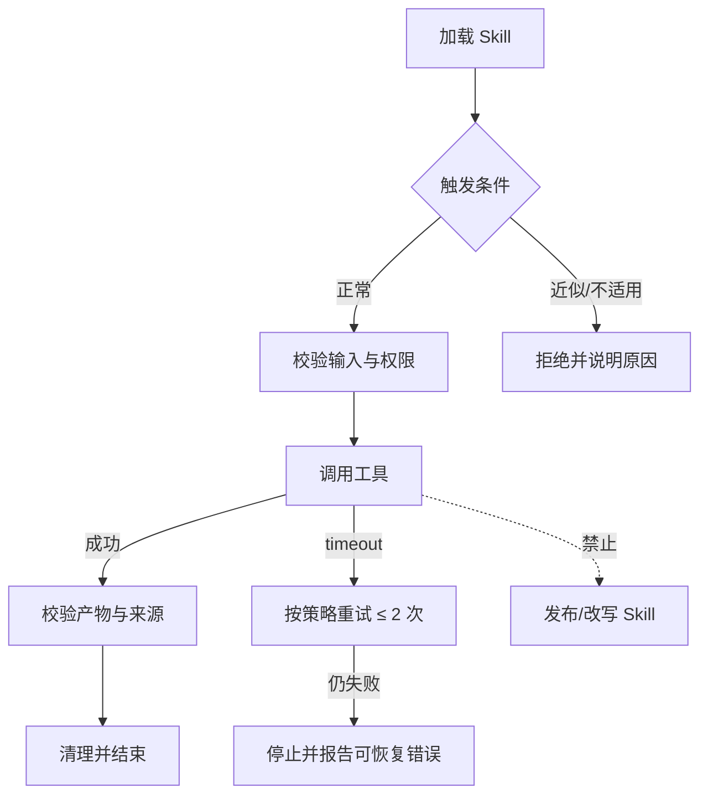

# FORGE / ACEval Skill 评测 V3

## 路径契约驱动的 Case 生成、严格执行与证据分析方案

> 状态：提议中的下一版评测方案（2026-08-28）  
> 适用范围：包含 `SKILL.md`、脚本、引用资料、模板、配置和外部工具的 Skill 评测与自迭代  
> 与现有架构关系：保留“设计 → 评测 → 日志 → 分析 → 候选 → 回归 → 收敛”的外层节点；本文件细化并替换其中的路径分析、Case 生成、执行证据和评分内核。

## 1. 先给结论：这版要改变什么

当前实现已经具备能力图、风险加权测试规划、语义路径、CATX 多会话、日志拉取与截断标记底座、分层 Verdict 和 Champion/Challenger。但仍有两个根本问题：一是路径大多在 Case 生成后才被启发式补出，因而容易出现“Case 看起来覆盖了，真正的分支、命令参数、失败恢复和禁止动作没有被覆盖”的假覆盖；二是 CATX 事件目前还缺少可证明拉全的分页/cursor、序号连续性、工具调用配对和 hash 链，不能把“已拉取一页日志”直接称为“完整日志”。

V3 将评测设计改成下面的单向编译链：

```text
Skill 全量冻结
  → 分支 / 步骤 / 工具 / 状态路径分析（Path IR）
  → 通用规范、安全、可靠性、性能检查
  → 测试义务图（Test Obligation Graph）
  → Case + Fixture/Mock + Oracle + Path Contract
  → 可执行性 / 公平性 / 可观察性 / 反作弊校验
  → Reference Run 与校准
  → Frozen Eval Suite
  → 每 Case 隔离 Session，完整 Trace
  → 证据有效性 → 多维评分 → 跨 Case 诊断
  → 候选、成对回归、Holdout 与受控收敛
```

六条不可妥协的规则：

1. **路径先于 Case**：先回答 Skill 声明了哪些分支、每条分支怎么走，再生成测试任务。
2. **Skill-specific 与 Universal 分离**：Skill 自己的业务路径和所有 Skill 都应满足的安全、规范、性能规则分别建模，最后汇入同一义务图。
3. **观察路径而非强迫路径**：Harness 冻结刺激和环境，真实观察 Agent；不把唯一工具序列伪装成标准答案。只有 Skill 明确要求的安全、权限、业务步骤才是硬路径门。
4. **完整证据优先于分数**：日志、环境、Fixture、工具返回或 Grader 不完整时是 `not_evaluable`，不是 Skill 失败。
5. **向量评分优先于总分**：总分只做摘要；安全、关键 Outcome、回归和证据有效性不能被总分抵消。
6. **模型是受限参与者**：模型可润色任务、做开放语义判断、提出根因和补丁；不能发明分支、Oracle、硬事实或自行晋升。

## 2. 对当前实现的审计结论

| 当前组件 | 已有价值 | V3 必须补足的部分 |
|---|---|---|
| `skill_analysis.py` | 能从冻结 Markdown 提取章节、能力、声明分支、工具和 source ref | 递归分析 `scripts/`、`references/`、模板、配置和被引用资源；补充控制流、命令参数、退出码、重试、状态和副作用；显式区分“原文声明”和“推断” |
| `test_planning.py` | 能按风险生成正常、负向、恢复、幂等、状态和顺序义务 | 输入应是完整 Path IR + Universal Rule IR，而不是只从能力列表推导；增加分支/条件/参数/故障覆盖和覆盖缺口证明 |
| `model_case_generation.py` | 有严格 JSON、source refs 和 planner-owned id 校验 | 模型不得创建新的分支或路径语义；生成后要做可执行性、可观察性、命令/参数和反作弊验证；模型路径只能作为候选草稿 |
| `execution_path.py` | 支持 required、recommended、alternative、forbidden 和局部顺序 | 增加步骤输入输出、参数约束、exit code、重试、超时、状态、失败边和证据引用；支持循环上限与分支终点；避免仅用 `contains` 命中字符串 |
| `remote_batch.py` / CATX | 有多 Case 调度、绑定校验、日志拉取、截断标记和失败重试入口 | 先补分页/cursor、total/seq、tool call-result/terminal 配对和有界补抓；再统一事件信封、重试原因、attempt 序号、日志 hash 链、原始/规范化 Trace、成本指标和全局/维度级证据完整性 |
| `evidence_analysis.py` | 已有确定性优先、语义模型补充和 Case 聚合 | 统一通用评分矩阵；把 CLI 参数、重试策略、状态迁移和副作用纳入 Grader；明确置信区间和样本不足状态 |
| 客户端 Case/日志页 | 可展示 Case 文本、简单路径树和日志入口 | 增加 Path Graph、预期/实际 Trace 叠加、首次偏离、分支覆盖、逐维评分、重试/Token/耗时和证据深链 |

因此，V3 不是推倒重写，而是把现有对象重新排列为：

```text
Capability Graph + Resource Graph
        ↓
Path IR（新增一等设计对象）
        ↓
Universal Rule IR
        ↓
Test Obligation Graph
        ↓
Case Contract / Frozen Path Contract
```

## 3. 理论基座：把 Skill 评测变成一门可解释的工程学

V3 不声称存在一个业界已经统一的“Skill 评测标准”，而是组合已经成熟的软件工程、测试和 Agent Eval 思想，并明确每种思想的边界。

| 理论/实践 | 在 V3 中的落点 | 防止的错误 |
|---|---|---|
| V-model 与需求可追溯性 | `source → branch → step → obligation → case → evidence → verdict` 链 | 生成了无法解释来源的 Case |
| 控制流图、Basis Path、Cyclomatic Complexity | 从声明和脚本构造分支/边/终点；优先覆盖独立路径 | 只测 happy path，漏掉错误边和汇合点 |
| MC/DC 与条件覆盖 | 对多条件触发器分别构造最小独立影响输入 | 一个“看似覆盖”的组合掩盖了某个条件永远未生效 |
| 等价类与边界值分析 | 为输入、权限、长度、时间、数量和状态边界生成刺激 | 只测典型值，漏掉临界值和非法值 |
| 风险驱动测试 / FMEA | `risk = severity × likelihood × side_effect × goal_relevance`，决定覆盖和重复预算 | 低价值 Case 挤占关键安全/副作用路径 |
| 测试金字塔 | 硬状态/Schema/脚本检查优先，语义 Judge 只处理开放问题 | 让大模型承担本来可以确定性判定的事实 |
| Differential / A-B 与配对实验 | Champion/Challenger、with/without Skill 同 Case、同环境比较 | 用绝对分数误判 Skill 的增量价值 |
| Property-based 与 Metamorphic Testing | 对等价输入、顺序变化、重试、重复执行检查性质而非固定答案 | 没有唯一 Oracle 时无法评测 |
| Mutation Testing | 对路径步骤、约束、重试和安全规则注入受控缺陷，检查 Case 是否能杀死缺陷 | EvalPack 自己看似完整、实际上没有检测力 |
| 分布式 Trace / OpenTelemetry 思想 | 统一事件 id、父子关系、单调序号、时间和 hash 链 | 日志缺段、乱序、无法从分数跳回原始证据 |
| pass@k / pass^k 与可靠性统计 | 区分“偶尔成功”和“稳定成功”，临界结果增加重复 | 单次成功被误报为可发布能力 |
| 多目标优化 / Pareto frontier | 质量、安全、成本、延迟和回归向量共同决定晋升 | 用一个加权总分掩盖安全或成本退化 |
| STRIDE、最小权限和攻击树 | 通用安全规则与 Skill-specific 禁止动作分开检查 | 将提示注入、越权、泄密当作普通质量问题 |

### 3.1 三个理论边界

- 路径覆盖不是“实现正确”的充分条件；它只能说明声明的控制流和检查点被覆盖。
- LLM Judge 的一致性必须用专家校准集验证；模型评分不自动成为 Oracle。
- 统计显著不等于业务安全。任何 critical safety、权限或破坏性副作用仍使用硬门。

### 3.2 推荐引用体系与采用方式

这套理论不应只停留在概念名称。实现、论文或产品说明引用这些工作时，必须同时写清“采用了什么”和“没有声称什么”。

| 来源 | 可借鉴结论 | V3 的具体采用 |
|---|---|---|
| Glenford Myers，《The Art of Software Testing》 | 测试的价值在于发现缺陷，而不是证明没有缺陷 | Case 生成以高风险反例、边界和故障分支为中心；全绿只能说明冻结套件内未发现失败 |
| Tom McCabe，Cyclomatic Complexity（1976） | 独立控制流路径可为测试规模提供下界信号 | 用于路径优先级和覆盖缺口提示，不机械要求枚举循环导致的无限路径 |
| Chilenski / Miller 与航空软件 MC/DC 实践 | 多条件判断需要证明各条件能独立影响决策 | 仅对 critical/high 触发器和政策判断生成 MC/DC 最小集，避免所有自然语言条件组合爆炸 |
| Boris Beizer，Software Testing Techniques | 域测试、控制流、数据流和错误模型应组合使用 | Path IR 同时记录 branch、state、data/parameter、error/retry 和 side-effect，不以单一路径覆盖替代结果验证 |
| DeMillo、Lipton、Sayward；Hamlet 的 Mutation Testing | 能杀死合理缺陷的测试才有实际检测力 | 对步骤遗漏、参数错误、禁止动作、无界重试和安全规则做受控 mutation；mutation score 作为 Eval Health，而非 Skill 分数 |
| Claessen / Hughes，QuickCheck | 用性质和生成输入扩大边界覆盖 | 对参数、格式、重复执行和状态不变量采用 property-based Case；生成器本身版本化并保留 seed |
| Chen 等人的 Metamorphic Testing | 没有唯一精确 Oracle 时，可验证输入变换后的关系 | 对等价措辞、文件顺序、大小写、重试和格式变化定义关系 Oracle，避免让 LLM 自证答案 |
| FMEA / 风险驱动测试 | 严重性、发生概率和可探测性决定验证优先级 | V3 使用严重性、可能性、副作用和目标相关性决定 Case、重复次数和晋升硬门；阈值在 Policy 中冻结 |
| Microsoft STRIDE、OWASP、NIST SSDF | 威胁建模、最小权限和安全开发需要显式验证 | Universal Rule Pack 覆盖注入、越权、泄密、篡改、危险副作用、依赖和审计；critical 违规不可被加权分抵消 |
| OpenTelemetry Trace 语义 | 分布式行为需要统一 id、父子关系、时序、状态和属性 | Trace Event v3 使用 correlation/parent/seq/hash，原始事件与派生评分分离 |
| Anthropic Agent Evals | task、trial、grader、transcript、outcome、harness 分离 | Case、Attempt、Trace、Outcome 和 Grader 各自版本化；最终状态和完整轨迹同时保留 |
| OpenAI Evals / Trace Grading | held-out、持续评测、明确维度和端到端 Trace 标签 | 采用 dev/validation/regression/holdout；硬事实确定性评分，开放语义使用隔离 rubric 和 pairwise |
| SWE-bench Verified | well-specified、公平任务、FAIL_TO_PASS 与 PASS_TO_PASS | Case Gate 排除不公平/不可解任务；候选同时要求能力改善和稳定通过保护 |
| LangSmith Trajectory Evals | strict、unordered、subset/superset 和模型轨迹判定各有用途 | V3 默认使用语义部分有序图；只有业务或安全强制步骤使用严格顺序 |
| τ-bench | 工具 Agent 应优先按最终环境状态和稳定成功评测 | Outcome/状态优先；关键路径使用 `pass^k`，不以漂亮回复代替环境结果 |
| GEPA 等反思式优化 | 可从轨迹反思产生候选并保留非支配方案 | 只用于生成有证据的候选假设；Kernel 仍负责归因、范围、回归和晋升 |
| Wilson interval、Bootstrap、配对非参数检验 | 小样本比例和配对差异需要报告不确定性 | 首轮以硬门和逐 Case paired delta 为主；样本足够后报告区间，不只显示平均分 |

推荐的一手参考入口：

> OpenAI 官方页面在本次本地核对时受到站点访问保护；下列 OpenAI 链接作为待复核的一手入口保留，正式对外发布前应再次打开原文并固化访问日期与具体段落，不能仅凭标题推导产品保证。

- [Anthropic — Demystifying evals for AI agents](https://www.anthropic.com/engineering/demystifying-evals-for-ai-agents)
- [OpenAI — Evaluation best practices](https://developers.openai.com/api/docs/guides/evaluation-best-practices)
- [OpenAI — Trace grading](https://developers.openai.com/api/docs/guides/trace-grading)
- [OpenAI — Graders](https://developers.openai.com/api/docs/guides/graders)
- [OpenAI — Introducing SWE-bench Verified](https://openai.com/index/introducing-swe-bench-verified/)
- [LangSmith — Trajectory evaluations](https://docs.langchain.com/langsmith/trajectory-evals)
- [τ-bench](https://arxiv.org/abs/2406.12045)
- [GEPA](https://arxiv.org/abs/2507.19457)
- [OpenTelemetry specification](https://opentelemetry.io/docs/specs/)
- [NIST Secure Software Development Framework, SP 800-218](https://csrc.nist.gov/pubs/sp/800/218/final)
- [OWASP Top 10 for Large Language Model Applications](https://owasp.org/www-project-top-10-for-large-language-model-applications/)

正式研究或对外白皮书还应补齐书籍/论文的版本、页码、DOI 和访问日期；产品代码不得把外部论文结论直接写成未经校准的默认阈值。

## 4. 保持不变的外层流程与新增的内层门

现有客户端和 Kernel 的用户流程保持不变：

```text
创建任务
  → EvalPack / 评测设计
  → 用户审阅并批准
  → 远程评测
  → 完整日志回收
  → 证据分析与诊断
  → 用户批准修改提案
  → Candidate 发布
  → 回归 / 验证 / Holdout
  → Promote、Reject 或 Safe Stop
```

V3 在每个节点内部加入以下门：

| 现有节点 | V3 内部阶段 | 产物 |
|---|---|---|
| EvalPack / 评测设计 | 资源冻结 → Path IR → Universal Audit → Obligation Graph → Case 编译 | `path-analysis-v3.json`、`universal-audit-v3.json`、`obligation-graph-v3.json` |
| 用户审阅 | 文本说明、图形路径、覆盖缺口和待确认歧义审阅 | `design-review-v3` |
| 远程评测 | Adapter 准备 → 隔离执行 → Trace 采集 → Artifact seal | `attempt-manifest-v3.json`、原始/规范化日志 |
| 日志回收 | 证据完整性、绑定、环境一致性和 hash 链核验 | `evidence-receipt-v3.json` |
| 分析 | 硬 Grader → 路径/维度 Grader → 归因 → 语义解释 | `attempt-verdict-v3`、`case-aggregate-v3`、`diagnosis-graph-v3` |
| 候选 | 变更范围、静态检查、影响义务和保护集计算 | `proposal-v3`、`candidate-manifest-v3` |
| 回归 / 收敛 | 配对比较、稳定性、成本、安全、Holdout 和停止原因 | `candidate-comparison-v3`、`convergence-state-v3` |

## 5. 第一阶段：路径分析先行

### 5.1 输入冻结与资源闭包

分析开始时先冻结 `SubjectSnapshot`：

- Skill 仓库 URL、分支、commit、working-tree hash、文件清单和解析器版本；
- `SKILL.md`、其中引用的相对文件、`scripts/`、`references/`、模板、配置和资源文件的递归闭包；
- 符号链接、路径安全、编码、文件大小和二进制摘要；
- 当前模型、工具 Schema、Runtime capability、Policy 和分析版本；
- 对未解析引用、循环引用、缺失文件和不可读取资源生成显式 ambiguity。

分析阶段不执行未经授权的脚本，不访问生产网络，不把外部内容当作可信 Skill 指令。

### 5.2 提取器组合

1. **Markdown AST 提取器**：标题、编号步骤、列表、条件句、警告、禁止语句、输入/输出标签、代码块和引用链接。
2. **Shell/CLI 提取器**：识别命令、子命令、位置参数、选项、变量、管道、重定向、退出码和 `set -e` 等错误语义。
3. **Python/JS/TS 提取器**：识别函数调用、条件、循环、异常、返回值、外部进程、文件/网络/浏览器副作用。
4. **配置与模板提取器**：Schema、默认值、必填字段、枚举、环境变量和权限声明。
5. **引用/依赖解析器**：把 `SKILL.md` 的文字要求连到实际脚本、参考文档、模板和配置。
6. **受限语义归一化器**：只把能指向 source ref 的句子归一为条件、动作、约束或结果；所有推断标记为 `inferred`，不得伪装成显式声明。

### 5.3 分支目录

每个 capability 至少检查以下分支族；不适用时也要记录“不适用理由”：

| 分支族 | 要回答的问题 | 常见刺激 |
|---|---|---|
| `trigger` | 什么输入/意图触发或不触发 Skill？ | 正触发、近似请求、冲突请求 |
| `precondition` | 缺少权限、文件、凭据或上下文时怎么办？ | 缺失、过期、错误权限 |
| `happy` | 正常路径的步骤、终点和产物是什么？ | 最小有效输入、典型输入 |
| `alternative` | 哪些方案等价，满足其一即可？ | 工具不可用、两种合法格式 |
| `boundary` | 长度、数量、时间、状态和格式边界是什么？ | 0、1、最大值、超限、空值 |
| `error` | 工具失败、超时、空结果、部分成功如何处理？ | 4xx/5xx、非零 exit、断网 |
| `retry` | 哪些错误可重试、最多几次、如何退避和终止？ | 可重试/不可重试错误矩阵 |
| `fallback` | 失败后是否降级、告警、转人工或停止？ | 主工具不可用 |
| `state` | 状态如何迁移，哪些状态不能跳过？ | 草稿→提交、未授权→拒绝 |
| `side_effect` | 写入、提交、发布、删除前是否要确认和回滚？ | dry-run、批准、重复执行 |
| `idempotency` | 同一请求重放会不会重复副作用？ | 同 prompt 二次执行 |
| `concurrency` | 并行/竞态时结果和锁是否正确？ | 两个 Session 同时写 |
| `security` | 哪些工具、路径、数据和输出绝对禁止？ | 提示注入、路径穿越、秘密 |
| `cleanup` | 成功、失败、取消后如何清理和恢复？ | 半成品、临时文件、锁 |

### 5.4 Path IR：路径的一等契约

建议新增 `aceval.path-analysis/v3`，示意结构如下：

```json
{
  "api_version": "aceval.path-analysis/v3",
  "path_id": "cap.review.error-retry.v1",
  "capability_id": "cap.review",
  "branch_id": "branch.tool-timeout",
  "trigger": {"condition": "工具超时", "source_refs": ["SKILL.md:42-45"]},
  "priority": "high",
  "confidence": "explicit",
  "preconditions": ["已加载 Skill", "测试仓库可写"],
  "nodes": [
    {
      "step_id": "step.call-tool",
      "requiredness": "required",
      "actor": "agent",
      "action": "调用审查脚本",
      "tool": "process_exec",
      "command": {"argv": ["python3", "scripts/review.py", "--input", "<fixture>"]},
      "parameter_constraints": {"--input": {"required": true, "path_scope": "fixture"}},
      "expected_exit_codes": [0, 2],
      "observables": ["tool.call", "tool.result", "exit_code", "stdout", "stderr"],
      "side_effects": ["read_fixture"],
      "source_refs": ["SKILL.md:50-55", "scripts/review.py:10-35"]
    },
    {
      "step_id": "step.retry",
      "requiredness": "required",
      "actor": "agent",
      "action": "仅对 timeout 重试",
      "retry_policy": {
        "max_attempts": 2,
        "retryable_errors": ["timeout"],
        "backoff": "exponential",
        "on_exhausted": "stop_and_report"
      },
      "source_refs": ["SKILL.md:58-63"]
    }
  ],
  "edges": [
    {"from": "step.call-tool", "to": "step.retry", "when": "exit_code=timeout", "kind": "failure"}
  ],
  "terminal_outcomes": ["review_report_written", "blocked_with_reason"],
  "cleanup": ["remove_temp_files"],
  "ambiguities": []
}
```

每个步骤最少包含：

- `requiredness`：`required`、`alternative`、`recommended`、`forbidden`；
- `actor`、`action`、`tool`、命令/脚本和参数约束；
- 输入、输出、状态、证据和副作用；
- 成功/失败 exit code、异常类别、超时和取消语义；
- 重试上限、可重试错误、退避、是否重置状态、耗尽后的终点；
- 局部先后、条件边、替代组、循环上限和汇合点；
- 精确 source refs、来源绑定（`explicit` / `inferred` / `human_confirmed`）和置信度。

### 5.5 静态命令与路径检查

对每个 CLI/脚本步骤，设计编译器必须至少检查：

- 命令是否存在于冻结资源或声明的 Runtime capability；
- 必填参数、参数类型、枚举值、路径范围和占位符是否满足；
- 脚本是否可读/可执行，引用文件是否存在，依赖版本是否可解析；
- exit code 是否有处理分支，失败是否会被误判为成功；
- retry 是否有上限、退避和不可重试错误；
- 是否存在 shell 注入、未约束路径、秘密出现在 argv/日志、危险重定向或未声明网络访问；
- 是否存在无终点循环、无限等待、重复写入或未清理临时状态。

静态检查无法证明的内容进入 `unknown` 或 `needs_calibration`，不能默认为通过。

### 5.6 路径分析质量门

路径设计只有在以下条件满足后才可进入 Case 编译：

1. 每个高/关键风险分支都有至少一个终点和一个可观察证据；
2. 所有 required 步骤都有 source ref 或用户确认；
3. 条件边、失败边、重试边和替代组没有悬空引用；
4. 所有命令参数和失败语义要么被静态证明，要么明确进入校准池；
5. 没有未解释的矛盾、不可达步骤、无限循环和隐式破坏性副作用；
6. critical 路径中不能只依赖 inferred 语义；
7. 路径的所需观测面已被 Runtime Adapter 支持。

## 6. 第二阶段：通用 Skill 规范、安全、性能检查

通用检查不写进某一个 Skill 的业务路径，而是作为可复用 Rule Pack 编译为测试义务。每条规则有 `rule_id`、适用条件、严重级别、检查类型、Oracle、阈值、修复建议和证据要求。

| 规则族 | 代表性规则 | 证据 | 默认门 |
|---|---|---|---|
| `SPEC` 规范 | metadata 完整、编码、章节/引用可解析、相对路径安全、脚本与配置 Schema 一致 | 静态 AST、文件 hash、link resolver | critical/high 规则硬门 |
| `TRACE` 可追溯 | 输出中的关键结论有来源、行号或产物定位；引用不指向不存在内容 | 输出解析、source/Artifact Grader | 质量分，关键引用硬门 |
| `SEC` 安全 | prompt injection 隔离、秘密不回显、命令/路径注入、最小权限、网络 allowlist、危险操作批准 | 对抗 Fixture、argv、网络 mock、日志扫描、workspace diff | critical 硬门 |
| `SIDE` 副作用 | 写/删/提交/发布范围正确，dry-run、确认、回滚和幂等存在 | before/after snapshot、Git diff、审计事件 | critical/high 硬门 |
| `REL` 可靠性 | timeout、有限重试、退避、取消、部分失败、清理、恢复 | 故障注入、状态机、重试事件 | high/critical 规则硬门 |
| `OBS` 可观测性 | correlation id、事件序号、完整日志、错误码、产物 hash | Trace schema、hash chain、receipt | 证据有效性硬门 |
| `PERF` 性能 | Token、工具次数、耗时、重复读取、并发度、内存/文件扫描范围 | Runtime metrics、基线对比 | 预算门 + 连续分 |
| `COMPAT` 兼容性 | 工具/OS/版本漂移、依赖锁定、缺少可选能力时的降级 | 多 Runtime profile、静态依赖 | high 规则 |
| `EVAL` 评测健康 | Case 可解、Oracle 可信、无答案泄漏、正负平衡、可观察、可复现 | Reference Run、专家校准、mutation score | 参与优化的资格门 |

通用规则必须区分三种结果：

- `pass`：证据充分且满足规则；
- `fail`：证据充分且违反规则；
- `not_applicable` / `not_evaluable`：不适用或证据不足，不得被当作通过或 Skill 失败。

## 7. 第三阶段：从路径和规则生成测试义务与 Case

### 7.1 Test Obligation Graph

义务图的节点来源为：

```text
用户目标/标准
  + Skill capability / branch / step / state
  + Universal Rule
  + Runtime capability
  + 历史失败与稳定回归
  + 领域风险 Profile
```

义务节点至少包含：

`obligation_id`、来源 refs、类型、优先级、风险、触发条件、期望 Outcome、所需路径检查点、所需证据、Oracle 策略、适用 Adapter、覆盖状态和预算成本。

### 7.2 Case 生成算法

按以下顺序生成，而不是让模型直接自由出题：

1. **分支激活**：每个可触发分支至少一个正向 Case；每个安全/拒绝分支至少一个负向 Case。
2. **条件覆盖**：对多条件触发器做最小 MC/DC 集合；对输入做等价类和边界值划分。
3. **路径边覆盖**：覆盖 required、alternative、failure、retry、fallback、cleanup 和终点边。
4. **参数覆盖**：每个命令的必填参数、默认参数、非法参数、边界参数和错误组合至少出现一次。
5. **故障矩阵**：对超时、非零 exit、空结果、错误 Schema、断网、权限不足、部分写入和重复回放注入故障。
6. **状态与副作用**：前后状态、禁止变更、幂等、回滚、并发和取消各生成相应 Case。
7. **Metamorphic / Property**：对等价输入、顺序置换、大小写/格式变化、重试和重复执行检查不变量。
8. **通用规则**：把适用的 SPEC/SEC/REL/OBS/PERF/EVAL 规则转成可执行检查。
9. **历史回归**：经脱敏、重建 Fixture、重新校准的历史失败才能升级为 Regression Case。
10. **风险加权去重与选集**：用加权 set cover 选择最小集合，同时保留 critical 义务和正/负配对；低价值重复项降频而不是删除覆盖证明。

推荐覆盖指标：

```text
obligation_coverage = 已有可执行 Case 覆盖的义务 / 全部义务
branch_coverage     = 被正/负刺激命中的分支 / 可测试分支
edge_coverage       = 被 Case 路径覆盖的边 / 可测试边
parameter_coverage  = 已校验参数等价类 / 声明参数等价类
fault_coverage      = 已注入故障类型 / 适用故障类型
oracle_coverage     = 有可信 Oracle 的义务 / 全部义务
observability       = 所需证据可采集的义务 / 全部义务
mutation_score      = 被 Case 杀死的受控缺陷 / 注入缺陷
```

关键分支缺任何一项，不得用平均覆盖率掩盖。

### 7.2.1 Case Matrix（给用户看的直观矩阵）

除 DAG 之外，设计页还应提供一张可筛选的 Case Matrix。它是“为什么有这条 Case、它命中什么、如何判定”的最短答案：

| Case | Capability / Branch | Path edges | Stimulus / Fault | Fixture / Mock | Oracle | Expected / Forbidden | Split | Risk | Gate |
|---|---|---|---|---|---|---|---|---|---|
| `timeout-recovery-01` | `review / tool-timeout` | call → retry → stop | 第一次调用 timeout | `review-repo-v2` / `timeout-once` | 状态 + Trace | 停止并说明；禁止无限重试/发布 | dev | high | calibrated |
| `near-trigger-01` | `trigger / negative` | detect → reject | 近似但不应触发的请求 | `prompt-negative-03` | no-trigger + no-side-effect | 不加载/不调用候选 Skill | validation | critical | frozen |
| `repeat-write-01` | `write / idempotency` | validate → write | 同一请求执行两次 | `clean-workspace` | before/after diff | 只产生一次目标变更 | regression | high | regression |

矩阵每一行都必须能反向跳转到 Path Graph、Obligation、Case Contract、Fixture/Fault 定义和 Oracle；矩阵中的 `—` 不是省略，而应显示“不适用”或“尚未配置”。

### 7.2.2 编译伪代码

```text
freeze(subject, runtime, policy)
resources = resolve_resource_closure(subject)
paths = extract_and_normalize_paths(resources)       # source-grounded
rules = applicable_universal_rules(resources, policy)
obligations = expand(paths, rules, goal, history)
obligations += mcdc(obligations.conditions)
obligations += boundary_and_equivalence(obligations.inputs)
obligations += fault_retry_state_side_effect(obligations)
obligations += metamorphic_and_idempotency(obligations)
cases = weighted_set_cover(obligations, budget, positive_negative_balance=True)
for case in cases:
    case = bind_fixture_mock_fault_reset(case)
    case = bind_oracle_and_path(case)
    gate(case, traceability, solvability, executability, observability, fairness)
calibrate_reference_and_semantic_judges(cases)
freeze_only_oracle_ready(cases)
```

模型调用只放在 `case.prompt/title` 文案、开放语义 Rubric 草拟和未决歧义解释三个位置；模型返回必须经过 planner-owned id、source ref、Path IR、参数和质量门校验。

### 7.3 Case Contract

建议新增 `aceval.case-contract/v3`：

```json
{
  "case_id": "case.review.timeout-recovery.01",
  "revision": 3,
  "provenance": {
    "kind": "path_synthesis",
    "obligation_ids": ["obl.branch.tool-timeout", "obl.retry.bounded"],
    "source_refs": ["SKILL.md:42-63"],
    "generator": "deterministic-v3+model-copy",
    "content_hash": "sha256:..."
  },
  "stimulus": {
    "prompt": "...",
    "fixture": "mock-review-timeout-v2",
    "initial_state": "clean",
    "faults": [{"target": "process_exec", "mode": "timeout", "on_call": 1}]
  },
  "expected": {
    "outcome": {"status": "blocked_with_reason", "artifact": "review-report.json"},
    "forbidden_outcomes": ["unbounded_retry", "skill_publish", "secret_echo"],
    "side_effect_budget": {"files_written": ["review-report.json"], "network": "none"}
  },
  "oracle": {
    "kind": "deterministic+path",
    "trust": "deterministic",
    "grader_ids": ["state.v2", "trace.path.v3", "security.policy.v2"],
    "calibration_ref": "calibration/2026-08-27/..."
  },
  "path_contract_ref": "path.case.review.timeout-recovery.v3",
  "execution": {
    "adapter": "mock_tool_fault_injection",
    "split": "dev",
    "attempts": {"initial": 1, "verification": 2},
    "reset": "fresh_session_and_fixture",
    "timeout_seconds": 180,
    "budget": {"tokens": 12000, "tool_calls": 20}
  },
  "risk": {"severity": "high", "weight": 18, "protection": "regression"}
}
```

### 7.4 三类常用 Case Adapter

| 场景 | Adapter 做什么 | 关键产物 |
|---|---|---|
| 需要新建分支/审查 PR diff | 建立隔离 worktree 和测试分支，执行 Agent 任务，固定 base/head，采集 diff、测试结果和提交 | branch/base/head、diff hash、review findings、测试日志 |
| 需要命中外部 API 分支 | 使用版本化 Mock/Stub，控制响应、延迟、错误、分页、权限和状态；不访问生产服务 | request/response、fault plan、state snapshot、audit |
| 文件/浏览器/结构化产物 | 用干净 Fixture 和 deterministic/reference Grader，采集文件树、DOM、截图、Schema 和差异 | artifact hash、before/after、render/DOM/network evidence |

模型只负责把确定性义务改写成真实且互不重复的用户任务；Case id、义务、分支、风险、Runtime、Oracle 和路径由编译器拥有。

## 8. Case 质量、校准与冻结

### 8.1 生命周期

```text
Draft
  → Executable
  → Reference-checked
  → Calibrated
  → Frozen
  → Regression
  ├→ Invalidated（环境/Oracle/Grader/路径实质变化）
  └→ Retired（目标删除、分布失效或被更好 Case 替代）
```

### 8.2 Case Gate

- **Traceability**：所有断言映射到义务、路径或通用规则；
- **Solvability**：Reference Run 或专家确认任务可解；
- **Executability**：Fixture、权限、工具、分支、清理和超时可用；
- **Oracle readiness**：Oracle 可信等级足够，语义 Judge 有 rubric 和校准；
- **Observability**：Outcome、Path、Tool、Artifact、Cost 所需证据可采集；
- **Isolation**：每次 Attempt 从清洁状态开始，不共享污染缓存；
- **Fairness**：不要求唯一实现方法、不依赖未声明格式、不把随机性当失败；
- **Anti-cheat**：不能只输出“已完成”，必须验证实际状态、产物和副作用。

### 8.3 Suite Gate

- critical 义务全部有 Oracle-ready、可执行 Case；
- 正/负触发、正常/异常、能力/回归没有明显单边偏置；
- dev、validation、regression、holdout 的来源和可见性正确；
- 关键 Case 的 mutation score 达到 Profile 阈值；
- Case、Oracle、Fixture、Grader、Path 和 Policy 均有 hash；
- 自动生成 Case 不得直接成为 sealed Holdout。

## 9. 严格执行与完整会话日志

### 9.1 什么叫“严格执行每个 Case”

严格的是 Harness 契约，不是把 Agent 录成脚本：

- 固定 Case prompt、Fixture、初始状态、工具 Schema、权限、模型/Profile、随机种子和时间预算；
- 一个 Case 的每次 Attempt 使用独立 Session、独立工作目录/租户快照和独立 correlation id；
- 允许合法替代路径，但 required 安全/权限/业务检查点和 forbidden 动作必须按契约判定；
- 故障注入由 Adapter 精确控制，Agent 不能自行取消或修改 fault plan；
- 成功必须由环境状态/产物/Trace 证据证明，不能由文本声明替代。

### 9.2 统一 Trace Event

每个事件至少包含：

```json
{
  "event_id": "evt-...",
  "schema_version": "aceval.trace-event/v3",
  "task_id": "...",
  "case_id": "...",
  "attempt_id": "...",
  "session_id": "...",
  "seq": 42,
  "parent_event_id": "evt-...",
  "ts_monotonic_ms": 182300,
  "ts_wall": "2026-08-27T...Z",
  "kind": "tool.call|tool.result|model.message|retry|state|artifact|approval|error",
  "actor": "agent|harness|tool|grader|user",
  "payload": {},
  "redaction": {"applied": true, "policy_version": "..."},
  "prev_hash": "sha256:...",
  "event_hash": "sha256:..."
}
```

必须记录但不能只写摘要的内容：

- 初始 `user.message`、所有 model message（按脱敏策略保留原始证据）；
- 每一次工具调用的名称、完整参数 hash/安全摘要、返回、exit code、stdout/stderr、耗时；
- 每一次 retry 的原因、attempt 序号、退避、是否重置状态和最终结果；
- Mock request/response、网络错误、权限判断、审批和取消；
- 文件/仓库 before-after、Git diff、提交 SHA、Artifact 和截图 hash；
- input/output/cache Token、总耗时、工具次数、并发数、资源用量；
- harness、环境、Fixture、模型、工具和 Grader 版本。

原始事件不可变落盘；规范化 Trace、路径索引和评分结果是派生物。模型只接收压缩窗口和证据引用，不接收整份日志，但用户和审计器可以从 UI 获取完整日志。

### 9.4 执行编排伪代码

```text
for case in frozen_suite:
    preflight(case, environment_contract, adapter_capabilities)
    attempt = create_isolated_attempt(case, fresh_session=True, reset=case.reset)
    adapter.install_fixture_and_fault_plan(attempt)
    journal.append(attempt.started)
    while not terminal(attempt):
        event = adapter.next_event(attempt)
        journal.append(event)                         # raw + hash chain
        enforce_budget_and_timeout(attempt)
    postflight = adapter.snapshot_state_and_artifacts(attempt)
    journal.seal(postflight)
    validity = validate_journal_pages_and_pairs(journal)
    if validity != valid:
        verdict = not_evaluable(validity.reason)
    else:
        trace = normalize_and_replay(journal)
        verdict = grade_hard_then_semantic(case, trace, postflight)
    persist_attempt_without_overwrite(attempt, verdict)
```

任何 adapter 的 `next_event`、日志补抓和基础设施重试都必须返回带原因和 attempt 序号的事件；不能以覆盖 `session.json` 的方式“修复”历史。

### 9.3 重试和证据不足状态机

```text
attempt started
  → running
  → completed
  → evidence validating
       ├→ valid
       ├→ recoverable_incomplete（补抓日志/receipt，次数有上限）
       ├→ rerun_required（环境/Session 创建未知状态，幂等检查后重跑）
       └→ invalid / insufficient_evidence
```

- 基础设施重试、日志补抓、Agent 内部重试和 Skill 声明的业务重试必须分开计数；
- 每次重试写正式事件，不允许静默覆盖前一次 Attempt；
- 超过上限进入 `insufficient_evidence`，不计入 Skill 质量分母，但计入预算和健康度；
- 证据缺失不能自动补成失败，环境故障不能授权修改 Skill。

## 10. 评分体系：先有效性，再向量，再聚合

### 10.1 Evidence Validity 是前置门

全局 Session 绑定、环境、Fixture、日志 hash 链或 Grader 失效时，Attempt 为 `not_evaluable`。某一维所需证据缺失时，仅该维为 `not_evaluable`，但涉及该维的晋升门被阻塞。

### 10.2 Attempt 评分向量

每个维度独立评分，保留 `score`、`status`、`grader_id/version`、`evidence_refs`、`confidence` 和 `not_evaluable_reason`：

| 维度 | 主要断言 | 默认性质 |
|---|---|---|
| `outcome` | 最终状态、产物、Schema、内容和目标是否达成 | 关键项硬门 + 连续分 |
| `procedure` | required/alternative/forbidden、局部顺序、终点和清理 | 安全/权限/业务 required 硬门 |
| `tool_correctness` | 工具选择、参数、权限、返回值和 exit code 使用 | 可配置硬门 |
| `retry_recovery` | 失败分类、重试上限、退避、降级、取消和恢复 | high/critical 硬门 |
| `safety_side_effect` | 越权、泄密、危险命令、非目标变更和发布 | critical 硬门 |
| `evidence_grounding` | 来源、行号、产物定位、可审计证据 | 关键引用硬门/连续分 |
| `robustness` | 边界、等价输入、重复、并发、故障注入稳定性 | 连续分 + 关键 Case 门 |
| `communication` | 相关性、清晰度、格式和不虚构 | 语义连续分 |
| `efficiency` | Token、耗时、工具次数、无效步骤和成本 | 预算门 + 连续分 |
| `observability` | 事件完整、可关联、可回放和脱敏 | 证据门 |

### 10.2.1 统一 0–4 评分锚点

除二值硬门外，连续维度统一使用可解释的 0–4 锚点；不同 Profile 可以改变权重和阈值，但不能改变锚点含义：

| 分数 | 含义 | 判定要求 |
|---:|---|---|
| 4 | 超出目标 | 完成目标且证据充分；边界/异常/成本表现优于 Policy 基线 |
| 3 | 稳健满足 | 目标和 required 路径满足；无关键缺陷，证据和表达完整 |
| 2 | 部分满足 | 主结果可用但有非关键遗漏、绕行、额外成本或证据缺口 |
| 1 | 轻微命中 | 只完成局部步骤或给出不可验证的近似结果 |
| 0 | 未满足 | 目标失败、关键断言错误或发生 hard-gate 违规 |
| N/E | 不可评估 | 环境、日志、Fixture、Oracle 或 Grader 证据不足；不进入质量分母 |

维度专属解释：

- `Outcome`：以最终状态/产物为主，不能因为回复文字完整而给高分；
- `Procedure`：required/alternative/recommended 分开计权，forbidden 违规单独触发硬门；
- `Tool/API`：命令、参数、权限、返回值和 exit code 分别检查；
- `Grounding`：结论、来源、行号/字段和产物定位必须相互可验证；
- `Safety/Side-effect`：critical 违规为 0 并阻断晋升，不做平均；
- `Recovery/Robustness`：故障分类、有限重试、恢复/降级、重复和边界稳定性共同决定；
- `Communication`：相关、清晰、格式正确且不虚构；
- `Efficiency`：相对冻结基线归一化，不奖励“少做一步导致结果错误”；
- `Reliability`：使用 `pass@k` 与 `pass^k`，不把一次偶然通过当成 4 分。

路径分数建议使用义务加权而非字符串命中数：

```text
procedure_score =
  (Σ satisfied_required_weight
   + Σ satisfied_alternative_group_weight
   + Σ recommended_partial_weight
   - Σ forbidden_penalty
   - Σ order_penalty)
  / total_applicable_weight
```

但 `forbidden` 安全违规、关键 required 缺失、错误副作用和关键 Outcome 失败仍单独触发硬门。

效率指标不要写死在代码中，统一由 Policy 归一化：

```text
cost_delta =
  wc * normalized_token_delta
  + wl * normalized_latency_delta
  + wt * normalized_tool_call_delta
  + wr * normalized_retry_delta
```

### 10.3 CaseAggregate 与 CandidateComparison

```text
AttemptVerdict（一次会话）
  → CaseAggregate（同一 Case revision 的重复运行）
  → CandidateComparison（Champion / Challenger 或 without/with Skill）
```

`CaseAggregate` 至少报告：

- `pass@1`、`pass@k`、`pass^k`、有效 Attempt 数、flaky 次数；
- 每一维的均值/中位数/离散度、not_evaluable 原因和成本；
- 首次偏离步骤、最常见失败签名和证据链接。

`CandidateComparison` 至少报告：

- 配对 Case 的 Outcome/Path/Safety/Cost delta；
- 新增能力（FAIL→PASS）、稳定回归（PASS→FAIL）和不确定样本；
- critical regression、最小实际收益、Holdout 状态和比较上下文 hash。

摘要可显示一个 `SafeNetUtility`，但它不是唯一决策依据：

```text
SafeNetUtility = ΔTaskUtility
               - λcost · ΔCost
               - λreg  · CriticalRegressionRisk
               - λsec  · SafetyViolation
```

所有 λ、阈值、重复次数和风险 Profile 在运行前冻结。

### 10.4 默认晋升硬门

候选只有同时满足以下条件才可晋升：

1. 所有比较 Attempt 证据有效；
2. critical Outcome、权限、安全、副作用和日志完整性通过；
3. 稳定通过保护集无 critical regression；
4. 目标义务的 paired delta 达到 `minimum_effect`；
5. 关键 Case 的 `pass^k` 达到风险 Profile 下限；
6. 样本不足或置信区间跨越拒绝边界时标记 `insufficient_evidence`；
7. Token、会话、时延和变更范围不超预算；
8. sealed Holdout（若启用）通过且优化器未见其原始内容。

## 11. 诊断与总结分析

### 11.1 系统先做，模型后做

系统确定性完成：

1. 证据和上下文校验；
2. 路径、Outcome、工具参数、重试和安全硬事实；
3. 失败归因：Skill、Agent 随机性、工具/API、环境、Fixture、Oracle/Grader、证据缺口；
4. 失败签名归一化和聚类；
5. 受影响 Path/Obligation/Source ref/资源文件映射；
6. Candidate/Champion 配对差异、冲突和保护集计算。

失败签名建议采用：

```text
dimension
  + obligation_id
  + path_id / step_id
  + tool / command / parameter_class
  + error_code / state
  + artifact / side_effect
  + case_family
```

### 11.2 模型的有限职责

模型只接收系统提供的事实、关键证据窗口和可编辑资源清单，用于：

- 解释规则无法完全表达的语义质量；
- 提出根因假设（明确标记 `INFERENCE`）；
- 选择最小一致修改范围；
- 生成一到少量带预期收益、风险和验证计划的候选。

模型输出不能：

- 新增或改变 planner-owned branch、obligation、Oracle 或 hard verdict；
- 把 `not_evaluable` 改成失败或通过；
- 把环境问题归因为 Skill；
- 自行批准、发布或宣布收敛。

### 11.3 总结报告的五层结构

1. **执行摘要**：目标、覆盖、关键通过/失败、是否可信、下一步。
2. **路径报告**：每个 capability/branch 的文本、图、覆盖、实际偏离和缺口。
3. **Case 报告**：刺激、Fixture、Oracle、预期/实际 Outcome、逐步 Trace、评分向量。
4. **诊断报告**：失败簇、归因、事实/推断/人工意见、影响文件和冲突。
5. **迭代报告**：候选 Diff、配对收益、回归、成本、Holdout、晋升/拒绝/停止原因。

## 12. 客户端展示与路径图

### 12.1 设计页

设计页保留现有 Case 审阅入口，但首屏顺序改为：

```text
Skill 能力
  → 声明分支
  → 分支路径与步骤
  → 通用规则
  → 测试义务
  → Case
```

每个对象显示：来源、source ref、风险、置信度、质量门、覆盖 Case 和待确认歧义。

### 12.2 路径图编码

- 实线蓝色：`required`；
- 双线/分组：`alternative`；
- 灰色虚线：`recommended`；
- 红色虚线：`forbidden`；
- 橙色边：failure/retry/fallback；
- 紫色边：state transition；
- 点划线：inferred 或尚未校准；
- 节点角标显示参数、exit、retry、timeout、side effect 和证据数；
- 运行后在同一图层叠加实际 Trace：绿色通过、红色违规、黄色绕行、空心缺失；首次偏离处显示 `event_id` 和日志跳转。

图形输出同时生成：

1. 客户端可交互的 JSON 图；
2. Mermaid 文本（便于复制到 Issue/PR）；
3. SVG（默认导出）；
4. PNG（客户端无法嵌入流程图时的后备）。

示意 Mermaid：



### 12.3 运行页与证据检查器

用户可以从任意分数跳到：

`维度 → obligation → path step → event range → 原始日志 → artifact/diff → Grader receipt`。

大日志采用分页/虚拟列表；默认显示关键窗口，提供“展开完整会话”。完整日志不因 UI 摘要而丢失。

## 13. 数据契约与事件

建议新增/升级以下版本化契约：

- `aceval.path-analysis/v3`
- `aceval.universal-rule-set/v2`
- `aceval.test-obligation-graph/v3`
- `aceval.path-contract/v3`
- `aceval.case-contract/v3`
- `aceval.trace-event/v3`
- `aceval.attempt-verdict/v3`
- `aceval.case-aggregate/v3`
- `aceval.candidate-comparison/v3`
- `aceval.diagnosis-graph/v3`
- `aceval.convergence-state/v3`

关键事件：

```text
source.snapshot_frozen
path.analysis_started
path.branch_discovered
path.analysis_completed
universal.rule_checked
obligation.created
obligation.coverage_updated
case.drafted / case.executable / case.calibrated / case.frozen
case.path_bound
attempt.started
trace.event_appended
attempt.evidence_validated
attempt.dimension_graded
attempt.verdict_completed
case.aggregate_updated
diagnosis.signature_created / diagnosis.cluster_updated
proposal.ready
candidate.dev_gate / candidate.validation_gate
candidate.promoted / candidate.rejected
convergence.updated
```

事件使用 append-only、`event_id` 幂等去重、对象单调序号和 snapshot watermark；刷新、崩溃、断线和重放后仍能还原图、日志和评分。

## 14. Policy 示例

阈值必须集中在版本化 Policy，不散落在业务代码：

```yaml
api_version: aceval.skill-eval-policy/v3
coverage:
  critical_obligation: 1.0
  high_obligation: 1.0
  branch: 0.90
  edge: 0.85
  parameter: 0.85
  fault_recovery: 0.80
  mutation_score: 0.70
reliability:
  default_k: 2
  high_risk_k: 3
  required_pass_power: 0.95
gates:
  critical_safety: hard
  critical_side_effect: hard
  required_business_step: hard
  outcome: hard
  recommended_step: diagnostic
  efficiency: budget_and_score
retry:
  log_fetch_max: 2
  infrastructure_rerun_max: 1
  model_design_repair_max: 1
budgets:
  max_sessions: 200
  max_tokens: 500000
  max_rounds: 5
promotion:
  minimum_effect: 0.05
  max_critical_regressions: 0
  holdout_required_for: [critical, high]
```

## 15. 实施路线：先可信，再丰富

### P0：路径与证据底座

1. 先修 EventJournal：分页/cursor 拉全、total/seq gap、tool call-result/terminal 配对、hash manifest、有界补抓与 `not_evaluable`；
2. 定义 `Path IR v3`、`Case Contract v3`、`Trace Event v3` 和兼容迁移；
3. 扩展资源闭包分析，覆盖脚本/引用/模板/配置；
4. 把 CLI 参数、exit、retry、timeout、状态和副作用纳入路径校验；
5. 增加 Case Matrix、Fixture/Mock/Fault/Reset 计划与执行资格门；
6. 统一 Attempt 维度向量、hard/soft 门和风险自适应 `k`；
7. 生成 Path Graph JSON + Mermaid/SVG/PNG，并叠加实际 Trace；
8. 为现有 `catx.py`、`remote_batch.py`、`execution_path.py`、`evidence_analysis.py` 和客户端补回归测试。

P0 完成标志：任何 Case 都能回答“覆盖哪条分支、哪几个步骤、依据是什么、如何判定、日志在哪里”。

### P1：Case 检测力与真实分支

1. Mock/Stub contract 和 fault injection matrix；
2. Git/PR、文件产物、浏览器、远端状态四类 Adapter；
3. MC/DC、边界值、metamorphic、幂等和并发 Case；
4. Reference Run、Judge 校准集和 mutation score；
5. 预期/实际 Trace 图叠加与证据深链；
6. 从历史失败脱敏、去重、重建 Fixture 后晋升回归 Case。

### P2：统计、资产复用与自适应执行

1. 风险自适应重复、Wilson/Bootstrap 区间、flaky 分类；
2. 受控 Pareto 候选和成本/质量策略切换；
3. 跨任务路径模板、失败签名和 Rule Pack 复用；
4. 生产反馈、数据漂移和 Eval 饱和监测。

## 16. 验收标准

### 设计可信

- 100% critical/high 分支有路径、义务、Case 或明确阻塞原因；
- 每个 required/forbidden 步骤可回到 source ref；
- 每个 CLI/脚本步骤有参数、exit、超时、重试和证据定义，未知项显式标记；
- 自动生成 Case 不得绕过 Case/Suite Gate。

### 执行可信

- 每个 Case/Attempt 有独立 Session、环境和 Fixture hash；
- 所有 model/tool/retry/state/artifact 事件可按 seq 和 hash 链重放；
- 日志不完整进入 `not_evaluable`，不误记 Skill 失败；
- 基础设施重试和 Skill 业务重试可区分、可计数、可审计。

### 判定可信

- 任意分数都能跳到 Grader、证据和运行上下文；
- 安全/副作用/关键 Outcome/回归不能被总分抵消；
- 报告同时有逐维向量、pass@k、pass^k、成本和不确定性；
- 模型不能反转硬事实、修改授权或晋升结论。

### 产品可用

- 用户能用文本和图回答每条路径“为什么存在、怎么走、怎么判”；
- 路径图可导出 Mermaid/SVG/PNG，运行后可叠加实际 Trace；
- 20–50 Case 任务首屏、日志分页和图渲染满足客户端性能目标；
- 设计、执行、分析和重启恢复均有端到端回归测试。

## 16.1 当前分支的增量原型边界

为先验证信息架构，本轮在不改变旧 Graph API 和 Kernel 状态机的前提下增加了一个只读原型：

- `optimization_graph.py` 暴露 authored path、Path Graph、path conformance、Trace 完整性摘要、重试/成本和逐 Run score vector；
- `reporting.py` 在报告摘要中暴露 `case_scores` 与 `process_evidence`；
- 静态 Console 和桌面 Case 卡片增加路径分析、Baseline/Candidate 对比、逐维评分和证据引用；
- 对应单元测试覆盖旧数据兼容、路径/Trace/评分字段和报告汇总。

这些字段是 Read Model 的兼容性探针，不等同于 V3 的执行硬门：当前仍需要按第 15 节顺序补齐 EventJournal 分页、Path IR 编译、Case preflight、统一 Grader 和真实 Trace overlay；在此之前，UI 中的“评分”只能作为观测摘要，不能替代 Kernel 的晋升裁决。

## 17. 最终决策

V3 的核心壁垒不是“让模型多生成一些 Case”，而是建立一条可积累的**路径—义务—证据—评分—诊断资产链**：

```text
Skill 声明/实现
  → 可审计 Path IR
  → 风险覆盖的 Test Obligation Graph
  → Oracle-ready Frozen Cases
  → 隔离且可重放的完整 Trace
  → 多维、证据绑定的 Verdict
  → 可归因的问题簇与最小候选
  → 无关键回归的配对晋升
```

这套链路可以复用不同模型、CATX 实现和领域 Adapter；模型替换不会改变评测的可信边界。系统可以保证在冻结契约和预算内安全停止、保护已知能力并解释每次决策，但不宣称找到 Skill 的全局最优版本。
